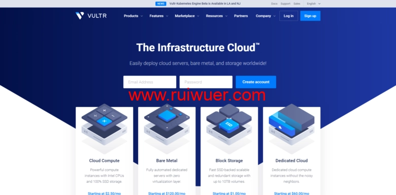

# VULTR充值活动：充多少送多少，有效期12个月，19个机房按需选择

---

如果你正在找一个**灵活付费**、**机房选择多**的海外VPS，那这次VULTR的活动值得关注。和以往30-60天的新用户赠送不同，这次充值赠送的有效期直接拉到了**12个月**，充多少送多少，最高送100美元。对于有长期使用需求的朋友来说，相当于用一半的价格用一年的服务器——前提是你是新用户，而且充值后要记得12个月内用完。

---

## VULTR是什么

VULTR是2014年成立的海外VPS服务商，最大的特点是**按小时计费**。你可以随时开机、关机、删除实例，不用担心浪费月费。目前VULTR在全球有**19个机房**，覆盖日本、新加坡、韩国、美国、德国、法国、荷兰、英国等地区，国内用户常用的是日本东京、新加坡和美国西海岸节点。

VPS基于KVM架构，支持Linux和Windows系统，也可以自定义ISO安装。支付方式包括支付宝和微信，对国内用户来说很方便。

---

## 这次活动怎么玩

操作很简单：

1. **创建新账户**（必须是新用户，老账户不能参加）
2. **充值任意金额**（充多少送多少，最高送100美元）
3. **获得同等赠金**（有效期12个月）

比如你充50美元，账户里会有50美元本金+50美元赠金，总共100美元可用。

---

## 几个需要注意的细节

**1. 扣款方式是本金和赠金各扣50%**

举个例子：你开了一台服务器，这个月消费了10美元，那么系统会从你的本金扣5美元，从赠金扣5美元。这意味着你的赠金会和本金同步消耗，用完为止。

**2. 赠金有效期是12个月**

和以往30-60天的活动相比，这次有效期长得多。但如果12个月内没用完，剩余赠金会过期。所以充值前最好估算一下自己的实际用量。

**3. 一个人只能注册一个新账户**

不要尝试用多个邮箱重复注册薅羊毛，VULTR会识别关联账户，重复注册可能导致账号被关。

**4. 活动时间有限**

官方说"limited time"，具体什么时候结束不知道，想参加的话别拖太久。

---

## VULTR的产品线

VULTR目前有4个系列：

**Cloud Compute（常规VPS）**  
这是大部分人会选的系列。SSD硬盘，19个机房可选，最低月付3.5美元起（部分机房5美元起，少数只提供IPv6的套餐2.5美元起）。按小时计费，随时可以删除实例。

**High Frequency（高频VPS）**  
采用NVMe高性能硬盘，价格比Cloud Compute稍高一点，同样19个机房可选。适合对磁盘IO要求高的应用。

**Bare Metal（裸金属服务器）**  
独享物理服务器资源，配置和价格都比较高，有10个机房可选。适合对性能要求极高的场景。

**Dedicated Cloud（独立云服务器）**  
独立资源的云服务器，配置较高，11个机房可选。介于VPS和裸金属之间。

如果你只是搭建个人网站、跑小程序、做代理，Cloud Compute系列足够用了。如果需要部署高并发应用或者对硬盘读写速度有要求，可以看看High Frequency系列。👉 [VULTR支持按小时计费，随用随删，特别适合需要灵活扩展资源的场景](https://www.vultr.com/?ref=9738262-9J)

---

## 为什么选VULTR

1. **按小时计费，灵活性高**  
不像传统VPS按月付费，VULTR可以随时开关删除实例，只为实际使用的时间付费。测试项目或者临时需求特别合适。

2. **机房选择多**  
19个机房覆盖全球主要地区，国内用户可以选日本、新加坡等亚洲节点，延迟相对较低。

3. **支持自定义ISO**  
除了官方提供的系统镜像，还可以上传自己的ISO安装系统，自由度很高。

4. **支持支付宝和微信**  
对国内用户友好，不用折腾信用卡或PayPal。

5. **这次活动有效期长**  
12个月的赠金有效期，比以往的短期赠送实用得多。

---

## 结语

VULTR的这次充值活动，对于需要长期使用海外VPS的用户来说确实划算。充多少送多少，相当于打了五折，而且有效期有12个月，不用担心短期内用不完。如果你正好需要一台灵活计费、机房选择多的VPS，👉 [VULTR的按小时计费和19个全球机房能满足大部分场景的需求](https://www.vultr.com/?ref=9738262-9J)。记得一定要用新账户注册，老用户不能参加活动。
